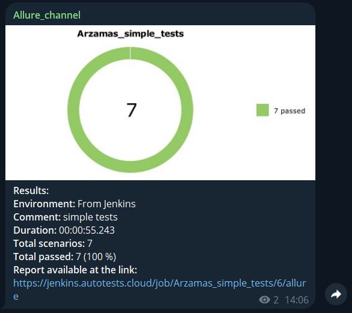

## Простые тесты для сайта Restful-booker

[Arzamas](https://restful-booker.herokuapp.com/)

---
 


Список проведенных проверок:
- Авторизация пользователя
- Создания заказа
- Редактирование заказа
- Удаление заказа
- Просмотр информации по заказу

---

Проект реализован с использованием актуальных инструментов:  
          


- Язык программирования `Python`
- Фреймворк для создания моделей тестирования `Pydantic`
- Фреймворк модульного тестирования `Pytest`
- Фреймворки для сбора отчетности и хранения файлов тестирования `Allure Report`
- Инструмент для сбора и хранения статистики тестов `Allure TestOps`
- Краткие отчеты в `Telegram` отправляет `Telegram Bot`

---

### Локальный запуск
Перед запуском в корне проекта создать файл .env с содержимым:
```
BOOKER_USERNAME="admin"
BOOKER_PASSWORD="password123"
```

Для локального запуска необходимо выполнить:
```
python -m venv .venv
source .venv/bin/activate
pip install -r requirements.txt
pytest .
```
Для получения отчета необходимо выполнить:
```
allure.bat serve tests/allure-results
```

## Пример отчета о прохождении api-тестов


Детальная информация с шагами и аттачментами отображается в разделе `Suites`


---
### Статистика отчета хранится в Allure TestOps
Последний отчет можно посмотреть на сайте [Allure TestOps](https://allure.autotests.cloud/launch/45643/?treeId=0)  
Для просмотра статистики после запуска в Jenkins в шаге 4 необходимо нажать на кнопку `Allure TestOps` 


Детальная информация по тест-кейсам


---
### Отчет о результатах тестирования в Telegram
Отчеты приходят в канал [Allure_channel](https://t.me/Allure_channel_autotests)




