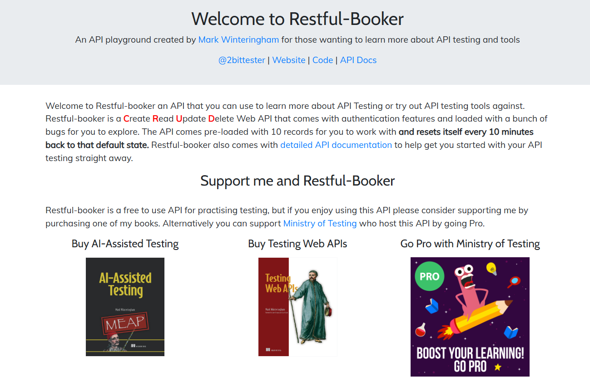
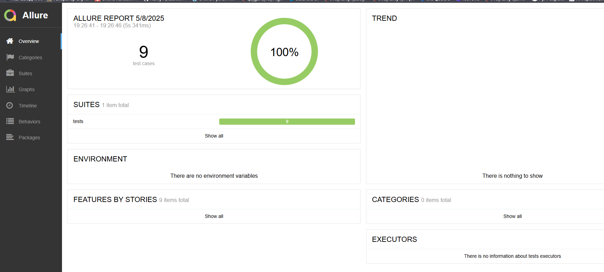
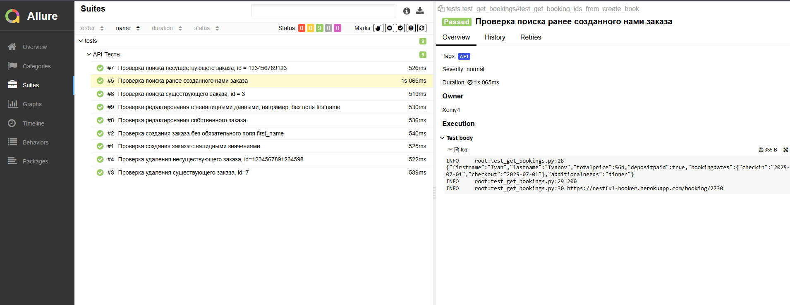
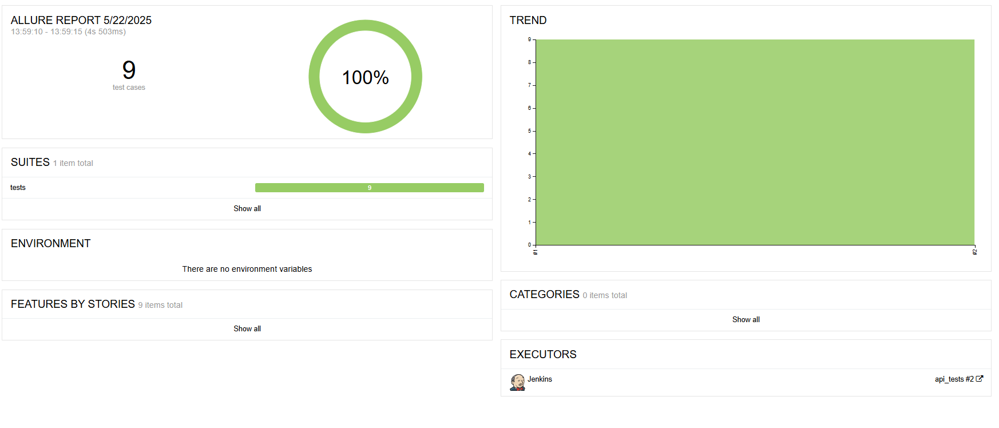
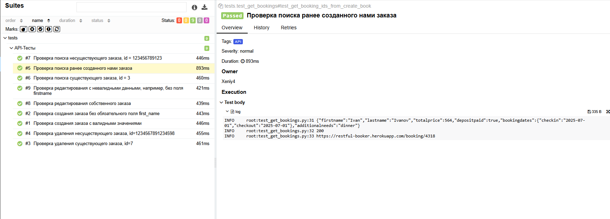
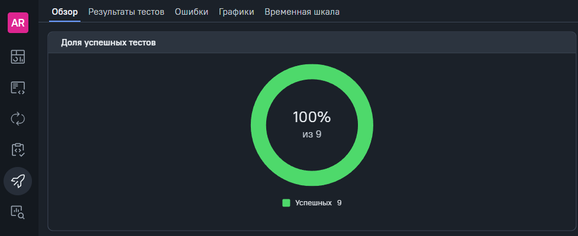
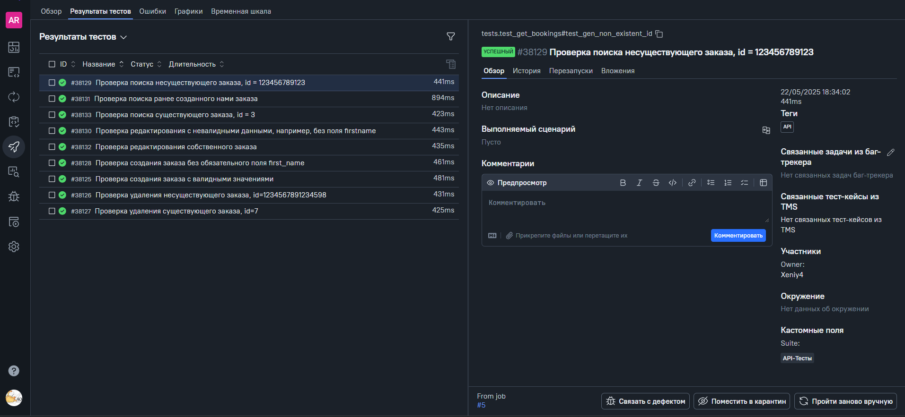
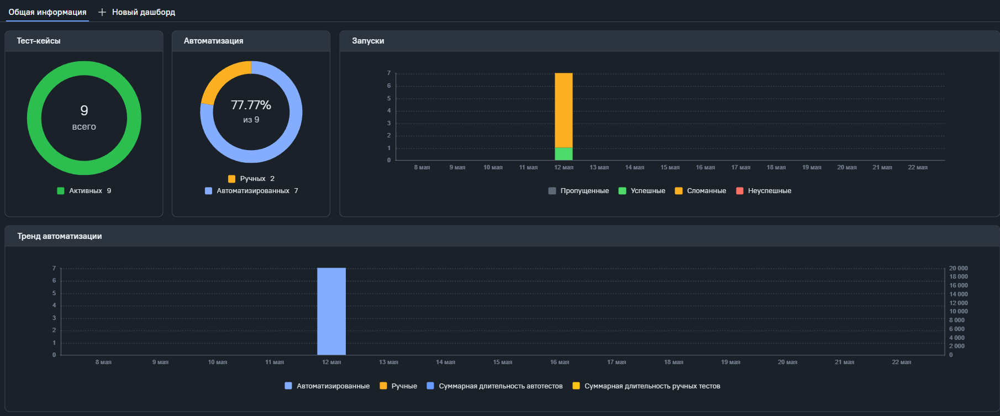
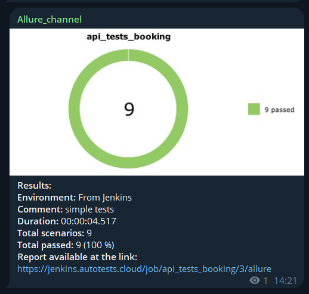

## Автотесты для сайта Restful-booker

[Restful-booker](https://restful-booker.herokuapp.com/)

---




Список проведенных проверок:

- Авторизация пользователя
- Создания заказа
- Редактирование заказа
- Удаление заказа
- Просмотр информации по заказу

---

Проект реализован с использованием актуальных инструментов:  
       

- Язык программирования `Python`
- Фреймворк модульного тестирования `Pytest`
- Фреймворк для создания моделей тестирования `Pydantic`
- Выполнение удаленного запуска тестов с помощью `Jenkins`
- Инструмент для сбора и хранения статистики тестов `Allure TestOps`
- Фреймворки для сбора отчетности и хранения файлов тестирования `Allure Report`
- - Краткие отчеты в `Telegram` отправляет `Telegram Bot`

---

### Локальный запуск

Перед запуском в корне проекта создать файл .env с содержимым:

```
BOOKER_USERNAME="your_username"
BOOKER_PASSWORD="your_password"
```

Для локального запуска необходимо выполнить:

```
python -m venv .venv
source .venv/bin/activate
pip install -r requirements.txt
pytest .
```

Для локального получения отчета необходимо выполнить:

```
allure.bat serve tests/allure-results
```

## Пример локального отчета о прохождении api-тестов



Детальная информация с шагами отображается в разделе `Suites`



---
### Удаленный запуск тестов выполняется в Jenkins
Посмотреть и запустить можно на странице проекта в [Jenkins](https://jenkins.autotests.cloud/job/api_tests_booking/).

Для запуска тестов необходимо:
1. Перейти на [проект](https://jenkins.autotests.cloud/job/api_tests_booking/)
2. Нажать на кнопку `Build now`
3. Дождаться окончания тестирования
4. Нажать на кнопку `Allure Report` 

Откроется страница отчета



Детальная информация с шагами и аттачментами отображается в разделе `Suites`



### Статистика отчета хранится в Allure TestOps
Последний отчет можно посмотреть по [ссылке](https://allure.autotests.cloud/launch/46489)  
Для просмотра статистики после запуска в Jenkins в шаге 4 необходимо нажать на кнопку `Allure TestOps` 



Детальная информация по тест-кейсам



Дашборд со статистикой и графиками запусков




### Отчет о результатах тестирования в Telegram
Отчеты приходят в канал [Allure_channel](https://t.me/Allure_channel_autotests)




